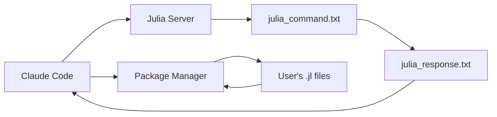

# 🚀 Julia REPL Server Skill

## Purpose

提供零编译时间的Julia开发环境。通过维持持久的Julia REPL服务器会话，消除Julia编译等待时间。

## Architecture Overview



### 核心组件

1. **Julia服务器** (`scripts/julia_server_launcher.jl`)
   - 持续运行的后台Julia进程
   - 文件通信机制：`julia_command.txt` ↔ `julia_response.txt`
   - 预加载核心包：Revise, BenchmarkTools

2. **智能包管理器** (`scripts/package_manager.jl`)
   - 自动扫描用户目录中的 `.jl` 文件
   - 提取 `using`/`import` 语句中的包名
   - 智能安装检测到的包依赖

3. **通信协议**
   - 客户端写入命令到 `julia_command.txt`
   - 服务器读取、执行并返回结果到 `julia_response.txt`

## How to Use

### 1. 环境设置

```julia
# 扫描当前目录的所有.jl文件，检测并安装需要的包
quick_auto_setup()

# 为指定文件设置环境
setup_julia_environment("my_analysis.jl")

# 最小环境（只安装Revise + BenchmarkTools）
setup_minimal_environment()
```

### 2. 启动Julia服务器

```bash
# 启动持久服务器（一次性）
julia --project=. scripts/julia_server_launcher.jl
```

### 3. 执行Julia代码

**执行用户的独立Julia文件：**
```julia
# 执行用户目录中的Julia文件
execute_julia("include(\"my_analysis.jl\")")

# 使用热重载执行（支持代码修改后立即生效）
execute_julia("includet(\"my_functions.jl\")")
```

**执行Julia命令：**
```julia
# 基础计算
execute_julia("2 + 2")
execute_julia("sqrt(16) + 3")

# 数据处理
execute_julia("using DataFrames; df = DataFrame(x=1:100, y=rand(100))")
execute_julia("describe(df)")
```

### 4. 包管理

**自动检测的包分类：**
- **核心包**：Revise (热重载), BenchmarkTools (性能测试)
- **检测包**：从用户 `.jl` 文件中自动提取所需包名

**手动包操作：**
```julia
# 查看当前环境已安装的包
execute_julia("using Pkg; Pkg.status()")

# 安装特定包
execute_julia("using Pkg; Pkg.add(\"Plots\")")
```

## Implementation Details

### 包检测算法

包管理器使用正则表达式扫描Julia文件：
```julia
# 匹配 using 和 import 语句
using_pattern = r"(?:using|import)\s+([^\s;]+)"

# 处理各种格式：
# using DataFrames → "DataFrames"
# using DataFrames, CSV → ["DataFrames", "CSV"]
# using Statistics: mean → "Statistics"
# using .LocalModule → 忽略（本地模块）
```

### 通信机制

1. **命令发送**：Claude Code写入 `julia_command.txt`
2. **命令处理**：服务器每0.5秒检查文件
3. **结果返回**：执行后写入 `julia_response.txt`
4. **清理**：删除命令文件，等待下一个命令

### 错误处理

- 服务器异常不会终止会话
- 错误信息通过响应文件返回
- 支持修改代码后立即重试

## Best Practices

1. **开发工作流**：
   ```julia
   # 使用includet()支持热重载
   execute_julia("includet(\"my_code.jl\")")

   # 修改代码后直接测试
   execute_julia("my_function(test_data)")
   ```

2. **性能监控**：
   ```julia
   # 基准测试
   execute_julia("@benchmark my_function(args)")
   ```

3. **文件组织**：
   - 将Julia文件放在主工作目录
   - 使用清晰的命名（如 `analysis.jl`, `utils.jl`）

## Key Resources

- `scripts/julia_server_launcher.jl` - 持久服务器进程
- `scripts/package_manager.jl` - 自动包检测和安装
- `references/julia_packages_guide.md` - Julia包使用参考
- `assets/project_templates/scientific_project_template.jl` - 项目模板